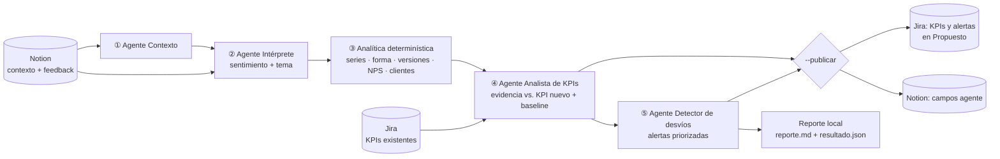

# Agente KPIs

**Sistema multi-agente que convierte el feedback de clientes en KPIs con punto de partida, evidencia y alertas de desvío, y los deja en Jira para que el Product Manager decida.** Sirve para cualquier producto: el contexto lo da la página de producto de cada uno.

```
Feedback en Notion ──► 4 agentes + analítica ──► KPIs y alertas en Jira (estado "Propuesto")
                                              └─► Tema y sentimiento de vuelta en Notion
```

> **Probalo en 1 minuto, sin credenciales:** `npm install` → `npm run demo` → `npm run evaluar`

---

## El problema

Los equipos de producto lanzan funcionalidades sin saber de dónde parten ni qué impacto tuvo lo que lanzaron, porque la voz del cliente y el trabajo del equipo viven en lugares separados y nadie los traduce a métricas:

- **No hay punto de partida**: no se mide el estado actual antes de construir.
- **No se mide el valor entregado**: se miden tickets cerrados, no si el problema del usuario se resolvió.
- **El feedback está disperso**: se lee de forma anecdótica y gana el cliente que más se queja, no el problema más frecuente.
- **No saben qué medir**: muchos equipos copian métricas genéricas.
- **Los desvíos se detectan tarde**: cuando alguien nota que algo empeoró, ya pasaron semanas y no se sabe qué lo causó.

**Visión:** que ninguna decisión de producto se tome a ciegas. Cualquier equipo, sin importar su tamaño, puede saber dónde está parado, qué valor genera y qué hacer después, con evidencia.

---

## User personas

### 🎯 Abel, Product Manager en una consultora de software (persona principal)
- **Contexto:** 34 años. Trabaja en una empresa que desarrolla productos para clientes y lleva 2 o 3 productos a la vez. Usa Jira todos los días.
- **Objetivos:** demostrarle al cliente el valor de lo que entrega el equipo y priorizar con argumentos, no por presión.
- **Frustraciones:** cada cliente tiene sus herramientas y su forma de medir, y armar un informe de impacto le lleva horas de juntar datos a mano. Cuando el cliente pregunta "¿esto sirvió?", no tiene una respuesta sólida.
- **Cómo usa Agente KPIs:** conecta Jira y el feedback de cada cliente, recibe KPIs propuestos para cada producto y alertas con evidencia que lleva directo a la reunión de seguimiento.
- > *"Sé que el equipo trabaja un montón, pero no puedo demostrar cuánto valor generó."*

### 🚀 Lucía, fundadora de una startup en etapa temprana
- **Contexto:** 29 años. Tiene un SaaS con 200 clientes y un equipo de 4 personas, sin product manager ni analista de datos.
- **Objetivos:** saber si va en la dirección correcta antes de quedarse sin plata, y mostrar avances a inversores.
- **Frustraciones:** recibe feedback por WhatsApp, mail e Intercom y no tiene tiempo de procesarlo. No sabe qué métricas mirar más allá de los ingresos.
- **Cómo usa Agente KPIs:** describe su visión y su problema y el sistema le sugiere qué medir. Usa los resúmenes como su "analista virtual".
- > *"Tengo mil cosas para hacer; necesito que alguien me diga en qué enfocarme."*

### 📊 Martín, Head of Product en una empresa mediana
- **Contexto:** 41 años. Tiene 4 product managers a cargo y le reporta a dirección.
- **Objetivos:** una vista unificada de la salud de todos los productos y alinear los KPIs con los objetivos de la empresa.
- **Frustraciones:** cada product manager mide distinto, los reportes no se pueden comparar y se entera de los problemas cuando ya escalaron.
- **Cómo usa Agente KPIs:** recibe alertas de desvíos con su causa probable y las usa para revisar los objetivos de cada trimestre.
- > *"No quiero más reportes, quiero saber qué está fallando y qué hacemos al respecto."*

### 🛠️ Sofía, Engineering Manager / Tech Lead
- **Contexto:** 36 años. Lidera a 8 desarrolladores y vive entre Jira y los deploys.
- **Objetivos:** saber si un deploy afectó a los usuarios y que el equipo reciba pedidos claros y justificados.
- **Frustraciones:** los tickets llegan sin contexto ("el cliente se queja de X"), sin evidencia ni prioridad clara.
- **Cómo usa Agente KPIs:** recibe tickets de Jira generados con evidencia (feedback asociado, KPI afectado, desde cuándo pasa) y ve si un deploy movió algún indicador.
- > *"Decime qué problema resolvemos y cómo vamos a saber si quedó resuelto."*

### 💬 Valentina, líder de Customer Success o Soporte (persona secundaria)
- **Contexto:** es la que más escucha al cliente, pero su voz pesa poco en la planificación de producto.
- **Objetivos:** que los problemas recurrentes de los clientes lleguen al equipo de producto con peso propio.
- **Cómo usa Agente KPIs:** carga el feedback y ve cómo se convierte en indicadores y en tickets.

📄 **Definición de producto completa** (problema, personas, visión, alcance, roles, flujo y backlog): [`docs/producto.md`](docs/producto.md)

---

## Qué hace

1. **Lee el contexto del producto** (problema, objetivos, usuarios, limitaciones e historial de versiones) desde Notion.
2. **Interpreta cada feedback nuevo**: sentimiento y tema de fondo (la causa, no el síntoma).
3. **Lo contrasta con los KPIs que ya existen en Jira**: si encaja, suma evidencia a ese KPI; si no, propone uno nuevo con definición, fórmula, fuente del dato, **baseline** y objetivo.
4. **Detecta desvíos**: distingue problemas constantes, picos y tendencias crecientes; atribuye regresiones a la versión que las causó; marca clientes en riesgo y advierte cuando la muestra es chica.
5. **Crea en Jira** los KPIs y las alertas en estado **Propuesto**, asignados al PM del producto, con la evidencia citada (`FB-n`) y próximos pasos.
6. **Completa en Notion** los campos `Tema (agente)`, `Sentimiento (agente)` y `Procesado (agente)`.

Una persona decide: el agente nunca aprueba ni descarta nada.

---

## Resultado en el producto de prueba

Se probó con **Cobros Recurrentes** (una app de cobro de cuotas por mail) y **120 feedbacks simulados** con cuatro patrones escondidos y ruido. El script de evaluación compara lo que detecta el agente con las respuestas esperadas, que **los agentes nunca ven**:

| Patrón escondido | Qué hizo el agente |
|---|---|
| **P1** El mail del pedido de cobro no le llega al pagador (constante) | Lo detectó y, como ya existía el KPI *Tasa de respuesta al pedido de cobro*, **le sumó la evidencia sin duplicarlo** |
| **P2** Regresión de v1.3: los comprobantes pegados en el mail dejaron de detectarse (pico) | **Alerta crítica, prioridad 1, atribuida a v1.3**, con hipótesis de causa, rollback sugerido y KPI nuevo |
| **P3** La conciliación manual no escala (creciente) | Tendencia creciente detectada, KPI de tiempo de conciliación con baseline numérico y cliente **EM-007 en riesgo** (NPS 7 → 4 → 2) |
| **P4** Impagos invisibles (constante) | KPI de latencia de detección de impagos con baseline |
| Ruido (41 feedbacks) | Filtrado: no generó KPIs |

**Puntaje: 20/20** en `npm run evaluar`, tanto en la demo como en la corrida conectada a Notion y Jira reales. También advierte que el NPS tiene muestra chica (n = 7 después de v1.3).

👉 Reporte completo generado por la demo: [`docs/ejemplo-reporte.md`](docs/ejemplo-reporte.md)

---

## Arquitectura

El flujo lo controla el código; cada agente es una llamada al modelo con **salida estructurada** (esquema validado) y una sola responsabilidad. **Los números los calcula el código, no el modelo.**



| Pieza | Responsabilidad | Archivo |
|---|---|---|
| Agente **Contexto** | Convierte la página de producto en un brief: objetivos, limitaciones y versiones con fecha | [`src/agentes/contexto.ts`](src/agentes/contexto.ts) |
| Agente **Intérprete** | Sentimiento y tema de fondo de cada feedback; mantiene estable el catálogo de temas entre corridas | [`src/agentes/interprete.ts`](src/agentes/interprete.ts) |
| **Analítica** (código) | Conteos por mes, forma de la serie (constante / pico / creciente / decreciente), ventanas simétricas antes y después de cada versión, NPS por período con aviso de muestra chica, clientes con NPS en caída o quejas repetidas | [`src/analitica/metricas.ts`](src/analitica/metricas.ts) |
| Agente **Analista de KPIs** | Separa ruido de señal; suma evidencia a KPIs existentes o propone nuevos (fórmula, fuente, baseline, objetivo, evidencia, prioridad) | [`src/agentes/analista.ts`](src/agentes/analista.ts) |
| Agente **Detector de desvíos** | Alertas con severidad, prioridad, hipótesis de causa, clientes en riesgo, advertencias y próximos pasos; no duplica alertas abiertas | [`src/agentes/desvios.ts`](src/agentes/desvios.ts) |
| Publicación | Tickets en Jira y campos en Notion, solo con `--publicar` | [`src/salidas/publicar.ts`](src/salidas/publicar.ts) |

### Decisiones de diseño

- **Workflow, no agente autónomo.** El orden de los pasos es fijo y lo controla el código: es más predecible, más barato y más fácil de evaluar que dejar que un modelo decida qué hacer.
- **El modelo interpreta, el código cuenta.** Conteos, formas de serie, NPS y comparaciones antes/después de cada versión son determinísticos. El modelo nunca recalcula números: los recibe y razona sobre ellos.
- **Evidencia trazable.** Todo KPI y toda alerta cita IDs `FB-n`; el código descarta IDs o claves de Jira inventados.
- **Jira es la fuente de verdad.** Antes de proponer, el agente lee los KPIs del producto (incluidos los descartados) para no duplicar.
- **Idempotente.** El feedback procesado se marca en Notion; una segunda corrida sin feedback nuevo no hace nada. Las alertas abiertas se actualizan con un comentario en vez de duplicarse.
- **Revisar antes de publicar.** Sin `--publicar` solo se genera el reporte. Las respuestas del modelo se cachean por entrada, así que lo que se revisó es exactamente lo que se publica.
- **Agnóstico de producto y de proveedor.** Sumar un producto es sumar un archivo en `config/productos/`. El modelo puede ser Gemini (Google), Claude (Anthropic) o cualquiera de OpenRouter, incluso uno distinto por agente, y se cambia con variables.
- **El modelo se elige midiendo.** Cada combinación se corrió contra la evaluación (ver [Modelos](#modelos)).

### Modelos

| Configuración (los 4 agentes) | Evaluación |
|---|---|
| **Gemini 3.6 Flash** (por defecto; es la que usa la demo grabada) | **20/20** |
| Gemini 3.5 Flash | 20/20 |
| OpenRouter gratuito: Intérprete `dots-3-note`, Analista `dots-3-note`, Detector `nemotron-3-super` | 16/20 |
| OpenRouter gratuito: Intérprete `nemotron-3-super`, Analista `dots-3-note`, Detector `nemotron-3-super` | 13/20 |
| OpenRouter gratuito: Intérprete `dots-3-note`, Analista y Detector `nemotron-3-super` | 12/20 |

Aprendizaje: los modelos gratuitos de OpenRouter agrupan bien los temas (el Intérprete con `dots-3-note` detectó las cuatro formas y atribuyó la regresión a v1.3), pero se quedan cortos en el paso que más razona, el **Analista**: no suman evidencia al KPI existente y separan peor el ruido. Por eso Gemini es el proveedor por defecto y OpenRouter queda como alternativa.

**Configuración sugerida para producción: OpenRouter con un modelo por agente.** Con una sola clave de OpenRouter (y crédito cargado) se puede asignar a cada agente el modelo que mejor rinde para su tarea, incluidos Gemini y Claude:

```env
AGENTE_PROVEEDOR=openrouter
AGENTE_MODELO_CONTEXTO=google/gemini-3.5-flash-lite        # extracción simple, el más barato
AGENTE_MODELO_INTERPRETE=dots-studio/dots-3-note-preview:free  # agrupó muy bien los temas en las pruebas
AGENTE_MODELO_ANALISTA=anthropic/claude-sonnet-5.5          # el paso que más razona
AGENTE_MODELO_DESVIOS=google/gemini-3.6-flash               # 20/20 en las pruebas con Gemini
```

Costo estimado: menos de USD 0,20 por corrida (unos 70.000 tokens de entrada y 15.000 de salida). Esta combinación todavía no se corrió contra la evaluación: antes de adoptarla, correla con `npm run demo` y `npm run evaluar`.

---

## Cómo correrlo

Requisitos: **Node.js 22 o superior**.

```bash
git clone https://github.com/latufabel/agente-kpis.git
cd agente-kpis
npm install
```

### 1. Demo sin credenciales

```bash
npm run demo       # corre todo el flujo con los datos locales de Cobros Recurrentes
npm run evaluar    # compara el resultado con las respuestas esperadas
```

La demo usa los datos de [`data/fixtures/`](data/fixtures/) y, si no hay API key, **reproduce las respuestas grabadas de una corrida real** ([`data/grabaciones/demo/`](data/grabaciones/demo/)). Nunca escribe en Jira ni en Notion. El reporte queda en `salida/cobros-recurrentes/reporte.md`.

Para correr la demo **en vivo** con un modelo, copiá `.env.example` a `.env` y completá una sola clave: `GEMINI_API_KEY` (gratuita en [Google AI Studio](https://aistudio.google.com/apikey)), `OPENROUTER_API_KEY` ([OpenRouter](https://openrouter.ai/keys), con modelos gratuitos `:free`) o `ANTHROPIC_API_KEY`. Elegí el proveedor con `AGENTE_PROVEEDOR` y, si querés, un modelo por agente con `AGENTE_MODELO_CONTEXTO`, `AGENTE_MODELO_INTERPRETE`, `AGENTE_MODELO_ANALISTA` y `AGENTE_MODELO_DESVIOS`. Una corrida tarda entre 2 y 5 minutos; los planes gratuitos tienen límites diarios (el agente reintenta solo ante saturación).

### 2. Conectado a Notion y Jira

Completá en `.env` la clave del modelo, `NOTION_TOKEN`, `JIRA_BASE_URL`, `JIRA_EMAIL` y `JIRA_API_TOKEN` (ver [`.env.example`](.env.example)), y después:

```bash
npm start -- --producto cobros-recurrentes              # lee Notion y Jira y genera el reporte, sin escribir nada
npm start -- --producto cobros-recurrentes --publicar   # además crea los tickets en Jira y completa Notion
```

### Desde VS Code, sin escribir comandos

`Ctrl+Shift+P` → **Tasks: Run Task** → elegí demo, evaluar, probar, publicar o reiniciar el feedback para una demo. Guía paso a paso: [`docs/guia-manual.md`](docs/guia-manual.md).

### 3. Automático (GitHub Actions)

- [`agente-kpis.yml`](.github/workflows/agente-kpis.yml): días hábiles a las 15:00 (Argentina) corre todos los productos de `config/productos/` y publica. También se puede disparar a mano eligiendo producto y si publica.
- [`ci.yml`](.github/workflows/ci.yml): en cada push corre typecheck, la demo y la evaluación.

Secrets del repositorio: la clave del modelo (`GEMINI_API_KEY`, `OPENROUTER_API_KEY` o `ANTHROPIC_API_KEY`), `NOTION_TOKEN`, `JIRA_EMAIL`, `JIRA_API_TOKEN` y `JIRA_BASE_URL`. Opcional: `AGENTE_PROVEEDOR` (`gemini`, `openrouter` o `anthropic`).

---

## Sumar un producto

1. **Notion:** una página de contexto del producto (problema, visión, usuarios, limitaciones, historial de versiones con fechas) y una base de feedback con las columnas `ID`, `Fecha`, `Canal`, `Tipo de usuario`, `Cliente`, `Emisor`, `Segmento`, `NPS`, `Resumen`, `Texto` y los campos del agente `Tema (agente)`, `Sentimiento (agente)` y `Procesado (agente)`. Compartí **solo** esa página con la integración.
2. **Jira:** un proyecto con los estados *Propuesto*, *En evaluación/reformulación*, *Aprobado* y *Descartado*. Convención: un **KPI** es un *Epic* `KPI: <nombre>` con las etiquetas `kpi` y la etiqueta del producto; una **alerta** es una *Tarea* `[P1][CRITICA] …` con la etiqueta `alerta-desvio`, hija del KPI que mueve.
3. **Configuración:** un archivo `config/productos/<id>.json` como [`cobros-recurrentes.json`](config/productos/cobros-recurrentes.json), con los IDs de Notion, el proyecto de Jira, los tipos de ticket, los estados y el PM responsable.

---

## Estructura

```
config/productos/        un archivo por producto
data/fixtures/           datos de la demo (contexto, 120 feedbacks, KPIs existentes)
data/grabaciones/demo/   respuestas grabadas del modelo para la demo sin credenciales
docs/                    definición de producto, guía manual y reporte de ejemplo
scripts/reiniciar-notion.ts  deja feedback sin procesar para una demo
scripts/evaluar.ts       evaluación contra las respuestas esperadas
src/agentes/             los cuatro agentes
src/analitica/           métricas determinísticas
src/fuentes/             Notion, Jira y fixtures
src/salidas/             reporte local y publicación
src/llm.ts               cliente del modelo (Gemini, Claude u OpenRouter), salida estructurada, grabaciones, caché y reintentos
src/pipeline.ts          orquestador
```

## Seguridad

- Las credenciales viven solo en `.env` (ignorado por git) o en los secrets de GitHub.
- La integración de Notion solo tiene acceso a la página del producto, no a las respuestas esperadas de la evaluación.
- En la demo, el campo `patron` del fixture (la respuesta esperada de cada feedback) se descarta antes de llegar a cualquier agente; solo lo usa `scripts/evaluar.ts`.
- La demo nunca escribe en sistemas externos.

## Limitaciones y próximos pasos

- El feedback de prueba es simulado; falta validar con productos y volúmenes reales.
- Los modelos gratuitos tienen cuotas diarias chicas y se saturan seguido; el agente reintenta solo, pero para uso diario conviene un plan pago o repartir agentes entre proveedores.
- Con miles de feedbacks por corrida habría que clasificar en lotes con un modelo más chico y resumir antes de analizar.
- Próximo: medir el impacto de cada versión sobre los KPIs aprobados, sumar más fuentes (soporte, tiendas de apps, analítica) y el backlog de mejoras sugeridas vinculadas a cada KPI.
