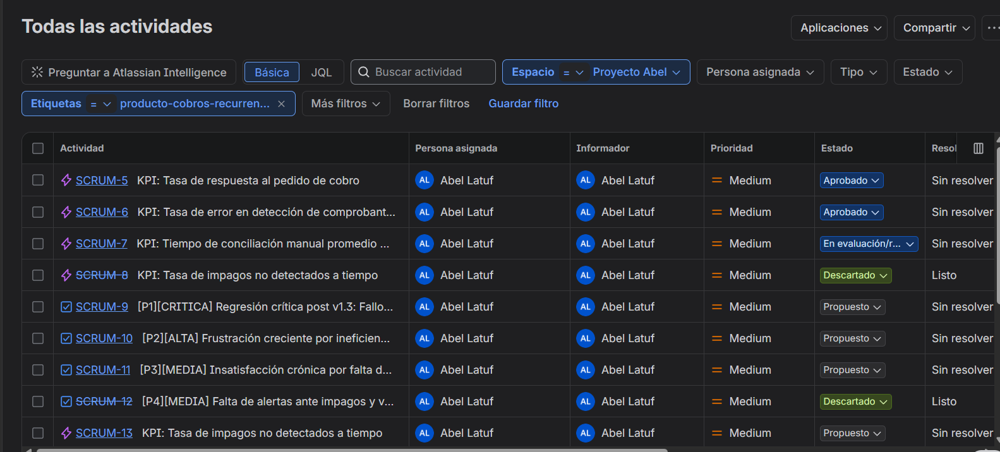
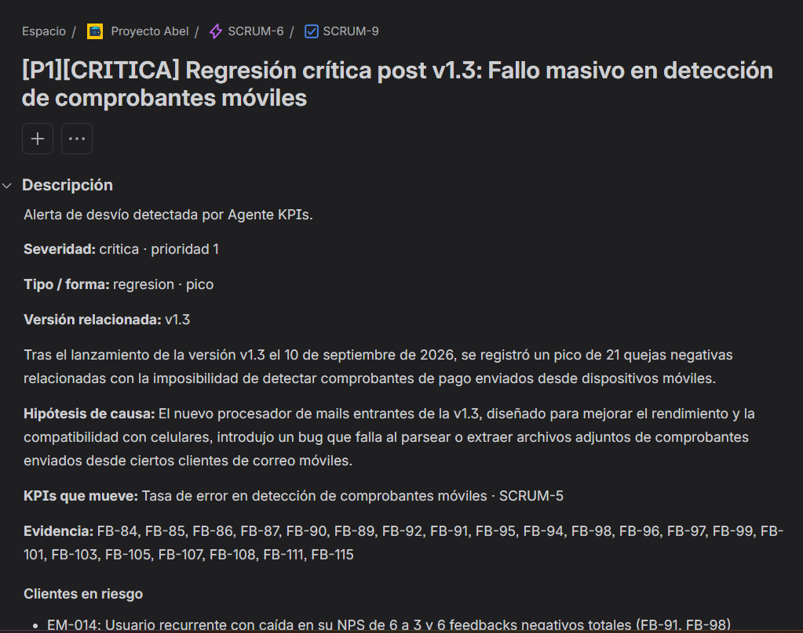
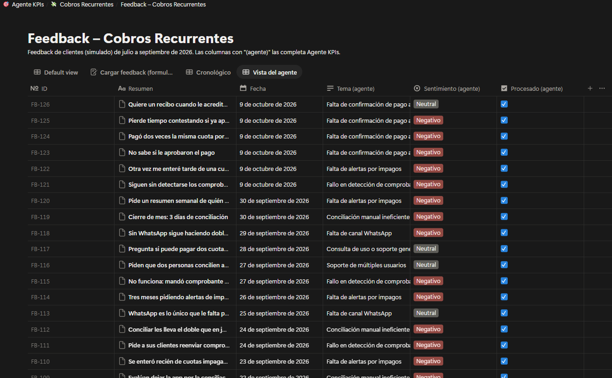

# Evidencia: qué quedó en Jira y Notion reales

Quien evalúa este repositorio no tiene acceso al Notion ni al Jira donde se probó el sistema. Este documento muestra lo que el agente escribió en ellos el **9 de octubre de 2026**, extraído directamente de las APIs de Jira y Notion después de las corridas (no está redactado a mano).

- **Notion:** base "Feedback – Cobros Recurrentes" (126 feedbacks).
- **Jira:** proyecto de prueba con los estados *Propuesto → En evaluación/reformulación → Aprobado → Descartado*.

## Línea de tiempo

| Hora (ART) | Qué pasó | Quién lo disparó |
|---|---|---|
| 11:17 | Se carga el KPI de prueba **SCRUM-5** *Tasa de respuesta al pedido de cobro* (estado Aprobado), para verificar que el agente suma evidencia en vez de duplicarlo | Preparación de la prueba |
| 11:46 | **Primera corrida publicada** sobre 120 feedbacks: suma evidencia a SCRUM-5, crea 3 KPIs (SCRUM-6/7/8) y 4 alertas (SCRUM-9 a 12) y completa los 120 feedbacks en Notion | Agente (manual) |
| ~11:50 | Segunda corrida sin feedback nuevo: *"No hay feedback nuevo: nada que hacer"* | Agente (manual) |
| 14:18 | El PM carga **FB-121** (cliente en riesgo, problema de v1.3) y publica desde VS Code: un comentario de evidencia en SCRUM-6 y la actualización de la alerta SCRUM-9. Nada duplicado | PM + agente |
| ~14:25 | El PM decide: SCRUM-6 **Aprobado**, SCRUM-7 **En evaluación/reformulación**, SCRUM-8 **Descartado** (y su alerta SCRUM-12) | PM |
| 14:51 | El PM carga **FB-122** sobre el tema descartado: el agente re-propone el KPI como **SCRUM-13** con la etiqueta `ya-propuesto`, más una alerta (SCRUM-14) y 3 **mejoras sugeridas** (SCRUM-15/16/17) | PM + agente |
| 15:04–15:07 | **Corrida automática de GitHub Actions** con 4 feedbacks sobre un tema nunca visto (FB-123 a 126): KPI nuevo SCRUM-18, alerta emergente SCRUM-19 y 2 mejoras (SCRUM-20/21) | GitHub Actions |
| ~15:20 | El PM revisa: SCRUM-18 y SCRUM-20 a **En evaluación/reformulación** (la mejora proponía algo que el producto ya hacía; se corrigió el agente) | PM |

## Jira: tickets creados por el agente



Todos asignados al PM. KPI = *Epic*; alertas y mejoras = *Tarea* hija del KPI que mueven.

```
SCRUM-5   KPI  [Aprobado]                     Tasa de respuesta al pedido de cobro            (KPI de prueba, cargado antes de correr el agente)
├─ SCRUM-11  Alerta [P3][MEDIA] [Propuesto]   Insatisfacción crónica por falta de canal WhatsApp
└─ SCRUM-21  Mejora P2 [Propuesto]            Recordatorio automático de vencimiento próximo

SCRUM-6   KPI  [Aprobado]                     Tasa de error en detección de comprobantes móviles
├─ SCRUM-9   Alerta [P1][CRITICA] [Propuesto] Regresión crítica post v1.3: fallo masivo en detección de comprobantes
└─ SCRUM-15  Mejora P1 [Propuesto]            Detección y soporte de imágenes incrustadas en correos desde el celular

SCRUM-7   KPI  [En evaluación/reformulación]  Tiempo de conciliación manual promedio por comprobante
├─ SCRUM-10  Alerta [P2][ALTA] [Propuesto]    Frustración creciente por ineficiencia en la conciliación manual
└─ SCRUM-17  Mejora P3 [Propuesto]            Previsualización continua y conciliación rápida en bandeja

SCRUM-8   KPI  [Descartado]                   Tasa de impagos no detectados a tiempo
└─ SCRUM-12  Alerta [P4][MEDIA] [Descartado]  Falta de alertas ante impagos y vencimientos

SCRUM-13  KPI  [Propuesto] ya-propuesto       Tasa de impagos no detectados a tiempo  (vuelve con evidencia nueva; referencia a SCRUM-8)
├─ SCRUM-14  Alerta [P3][MEDIA] [Propuesto]   Fricción sostenida por ausencia de alertas de impagos
└─ SCRUM-16  Mejora P2 [Propuesto]            Resumen semanal y panel de alerta de cuotas impagas para el emisor

SCRUM-18  KPI  [En evaluación/reformulación]  Tasa de soporte por confirmación de pago      (tema nuevo, corrida automática)
├─ SCRUM-19  Alerta [P5][BAJA] [Propuesto]    Emergente: demanda de confirmación para el pagador
└─ SCRUM-20  Mejora P1 [En evaluación/reformulación]  Confirmación automática de recepción de comprobante
```

### Ejemplos de lo que escribe el agente



**KPI re-propuesto después de un descarte (SCRUM-13, descripción):**
> Ya se había propuesto y se descartó (SCRUM-8). La evidencia actual lo vuelve a justificar; queda con baja prioridad para que lo reconsideres.
> **Definición:** porcentaje de cuotas vencidas en estado NO PAGADO que transcurren más de 7 días sin que el emisor realice una acción de visualización o reclamo.
> **Baseline:** 30 días. Los emisores reportan enterarse de deudas de meses anteriores recién en el ciclo siguiente (FB-9, FB-21, FB-122).
> **Objetivo:** reducir a menos de 7 días el tiempo de detección en un plazo de 60 días tras implementar alertas.

**Evidencia nueva sobre un KPI existente, en vez de duplicarlo (comentario en SCRUM-6, corrida incremental):**
> **Nueva evidencia (Agente KPIs).** La evidencia confirma una regresión severa en v1.3 afectando específicamente a imágenes pegadas en el cuerpo del mail desde móviles. El emisor EM-007 (FB-121) reporta 30 cuotas afectadas en un solo mes por este fallo.
> **Evidencia:** FB-121

**Actualización de una alerta abierta (comentario en SCRUM-9):**
> **Severidad:** crítica · prioridad 1 · **Tipo / forma:** regresión · pico · **Versión relacionada:** v1.3
> Aparición súbita de 21 reportes de falla en septiembre coincidiendo con el cambio de procesamiento de mails.
> **Clientes en riesgo:** EM-014 (NPS 6 → 3), EM-007 (Pyme, 140 pagadores, FB-96 y FB-121).
> **Advertencias:** la caída del NPS de septiembre a −100 debe tomarse con cautela: la muestra es de solo 9 respuestas.
> **Próximos pasos:** revisar logs de procesamiento de adjuntos; rollback parcial o hotfix de v1.3; contactar a EM-007 y EM-014.

**Mejora sugerida (SCRUM-16):** *Resumen semanal y panel de alerta de cuotas impagas para el emisor*, hija del KPI SCRUM-13, con historia de usuario, impacto esperado sobre el baseline, esfuerzo y criterios de aceptación.

## Notion: campos completados por el agente



Los **126 feedbacks** quedaron con `Tema (agente)`, `Sentimiento (agente)` y `Procesado (agente)` completos. Distribución de temas que armó el Intérprete:

| Tema (agente) | Feedbacks |
|---|---:|
| Fallo en detección de comprobantes móviles | 22 |
| Falta de canal WhatsApp | 20 |
| Conciliación manual ineficiente | 18 |
| Falta de alertas por impagos | 16 |
| Elogio general | 13 |
| Consulta de uso o soporte general | 11 |
| Mejoras de personalización y diseño | 8 |
| Flexibilidad en configuración de cuotas | 5 |
| Problemas de entregabilidad de correos | 4 |
| Falta de confirmación de pago al pagador *(tema nuevo, corrida automática)* | 4 |
| Integración con nuevos medios de pago · Soporte de múltiples usuarios · Exportación de datos | 2 · 2 · 1 |

Los últimos feedbacks, cargados por el PM durante las pruebas:

| ID | Tema (agente) | Sentimiento (agente) | Procesado |
|---|---|---|---|
| FB-121 | Fallo en detección de comprobantes móviles | Negativo | ✅ |
| FB-122 | Falta de alertas por impagos | Negativo | ✅ |
| FB-123 | Falta de confirmación de pago al pagador | Negativo | ✅ |
| FB-124 | Falta de confirmación de pago al pagador | Negativo | ✅ |
| FB-125 | Falta de confirmación de pago al pagador | Negativo | ✅ |
| FB-126 | Falta de confirmación de pago al pagador | Neutral | ✅ |
