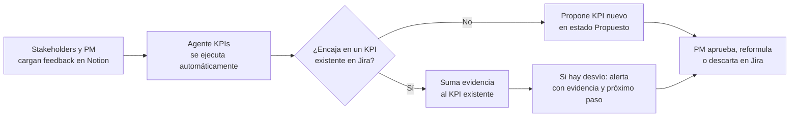

# Agente KPIs — Definición de producto

> **Agente KPIs** es un sistema multi-agente que analiza el feedback de clientes y los tickets de Jira, junto con el problema y la visión de cada producto, para proponer y monitorear KPIs, alertar desvíos con evidencia y generar próximos pasos accionables en Jira. Sirve para cualquier producto.

## 1. El problema

> Los equipos de producto lanzan funcionalidades sin saber de dónde parten ni qué impacto tuvo lo que lanzaron, porque la voz del cliente y el trabajo del equipo viven en lugares separados y nadie los traduce a métricas.

### Desglose

- **No hay punto de partida.** No se mide el estado actual antes de construir, así que después no hay contra qué comparar.
- **No se mide el valor entregado.** Se mide lo que se hizo (tickets cerrados, velocidad del equipo), no lo que logró (si el problema del usuario se resolvió).
- **El feedback está disperso y nadie lo ordena.** Soporte, reseñas, encuestas y Jira son fuentes separadas. Se lee de forma anecdótica y gana el cliente que más se queja, no el problema más frecuente.
- **No saben qué medir.** Muchos equipos, sobre todo los chicos, no saben qué indicadores representan valor para *su* producto, y terminan copiando métricas genéricas.
- **Los desvíos se detectan tarde.** Cuando alguien nota que algo empeoró, ya pasaron semanas y no queda claro qué lo causó.

### Consecuencia

Las decisiones de producto se toman por intuición o por la opinión de quien tiene más jerarquía. Se invierte en funcionalidades que no mueven nada y los problemas reales quedan escondidos en el ruido.

### Pregunta guía

**¿Cómo podríamos** ayudar a cualquier equipo de producto a pasar de "creemos que funciona" a "sabemos que funciona y por qué", sin necesitar un equipo de datos?

> ⚠️ Son **hipótesis**: hay que validarlas con 3 a 5 entrevistas cortas a gente de producto.

## 2. User personas

### 🎯 Abel, Product Manager en una consultora de software (persona principal)
- **Contexto:** 34 años. Trabaja en una empresa que desarrolla productos para clientes y lleva 2 o 3 productos a la vez. Usa Jira todos los días.
- **Objetivos:** demostrarle al cliente el valor de lo que entrega el equipo y priorizar con argumentos, no por presión.
- **Frustraciones:** cada cliente tiene sus herramientas y su forma de medir, y armar un informe de impacto le lleva horas de juntar datos a mano. Cuando el cliente pregunta "¿esto sirvió?", no tiene una respuesta sólida.
- **Cómo usa Agente KPIs:** conecta Jira y el feedback de cada cliente, recibe KPIs propuestos para cada producto y alertas con evidencia que lleva directo a la reunión de seguimiento.
- *"Sé que el equipo trabaja un montón, pero no puedo demostrar cuánto valor generó."*

### 🚀 Lucía, fundadora de una startup en etapa temprana
- **Contexto:** 29 años. Tiene un SaaS con 200 clientes y un equipo de 4 personas, sin product manager ni analista de datos.
- **Objetivos:** saber si va en la dirección correcta antes de quedarse sin plata, y mostrar avances a inversores.
- **Frustraciones:** recibe feedback por WhatsApp, mail e Intercom y no tiene tiempo de procesarlo. No sabe qué métricas mirar más allá de los ingresos.
- **Cómo usa Agente KPIs:** describe su visión y su problema y el sistema le sugiere qué medir. Usa los resúmenes como su "analista virtual".
- *"Tengo mil cosas para hacer; necesito que alguien me diga en qué enfocarme."*

### 📊 Martín, Head of Product en una empresa mediana
- **Contexto:** 41 años. Tiene 4 product managers a cargo y le reporta a dirección.
- **Objetivos:** una vista unificada de la salud de todos los productos y alinear los KPIs con los objetivos de la empresa.
- **Frustraciones:** cada product manager mide distinto, los reportes no se pueden comparar y se entera de los problemas cuando ya escalaron.
- **Cómo usa Agente KPIs:** recibe alertas de desvíos con su causa probable y las usa para revisar los objetivos de cada trimestre.
- *"No quiero más reportes, quiero saber qué está fallando y qué hacemos al respecto."*

### 🛠️ Sofía, Engineering Manager / Tech Lead
- **Contexto:** 36 años. Lidera a 8 desarrolladores y vive entre Jira y los deploys.
- **Objetivos:** saber si un deploy afectó a los usuarios y que el equipo reciba pedidos claros y justificados.
- **Frustraciones:** los tickets llegan sin contexto ("el cliente se queja de X"), sin evidencia ni prioridad clara.
- **Cómo usa Agente KPIs:** recibe tickets de Jira generados con evidencia (feedback asociado, KPI afectado, desde cuándo pasa) y ve si un deploy movió algún indicador.
- *"Decime qué problema resolvemos y cómo vamos a saber si quedó resuelto."*

### 💬 Valentina, líder de Customer Success o Soporte (persona secundaria)
- **Contexto:** es la que más escucha al cliente, pero su voz pesa poco en la planificación de producto.
- **Objetivos:** que los problemas recurrentes de los clientes lleguen al equipo de producto con peso propio.
- **Cómo usa Agente KPIs:** carga el feedback y ve cómo se convierte en indicadores y en tickets.

## 3. Visión

> Que ninguna decisión de producto se tome a ciegas: cualquier equipo, sin importar su tamaño, puede saber dónde está parado, qué valor genera y qué hacer después, con evidencia.

**Misión:** convertir el feedback de los clientes y el trabajo del equipo en indicadores accionables, alertas con evidencia y próximos pasos concretos, de forma automática y para cualquier producto.

| Plazo | Qué esperamos lograr |
|---|---|
| **Corto (MVP, este repositorio)** | A partir del problema, la visión, el feedback y Jira de un producto, el sistema propone KPIs con su punto de partida, detecta desvíos con evidencia y genera tickets de Jira accionables. |
| **Mediano (1 a 2 años)** | Monitoreo continuo con más fuentes (soporte, tiendas de apps, analítica, encuestas). Medición del impacto real de cada funcionalidad lanzada (antes y después del deploy) y benchmarks entre productos similares. |
| **Largo (3 a 5 años)** | Pasar de "detectar y alertar" a "anticipar": un copiloto de producto que aprende qué funcionó en cientos de productos y sugiere qué construir. |

### Principios de diseño
1. **Evidencia antes que opinión:** toda alerta o KPI cita el feedback y los tickets que lo respaldan.
2. **Sirve para cualquier producto:** nada depende de un dominio específico; el contexto lo dan la visión y el problema de cada producto.
3. **Una persona decide:** el sistema propone y el equipo aprueba, sobre todo antes de crear tickets.
4. **Accionable, no informativo:** cada hallazgo termina en un próximo paso concreto.

## 4. Alcance funcional del MVP

1. **Proponer KPIs por producto** a partir del problema, la visión, el feedback y los tickets de Jira, cada uno con su definición, su punto de partida (baseline) y la evidencia que lo respalda.
2. **Interpretar cada feedback nuevo y contrastarlo con los KPIs que ya existen en Jira** para ese producto, para no duplicar trabajo:
   - Si el feedback encaja en un KPI existente, se asocia a él como nueva evidencia. No se crea un KPI ni un ticket nuevo.
   - Solo si no encaja en ningún KPI existente, el sistema propone uno nuevo.
   - Jira es la fuente de verdad de los KPIs de cada producto.
3. **Alertar desvíos** con evidencia (feedback citado) y próximos pasos concretos.
4. *(Opcional)* **Backlog de mejoras sugeridas** vinculadas al KPI que buscan mover, aprobadas por una persona antes de crearse.

### Roles y flujo

- **Quién carga feedback (Notion):** los usuarios y stakeholders clave del producto. Al principio lo carga el Product Manager, pero el objetivo es escuchar a todos: soporte, ventas, dirección y clientes.
- **Quién aprueba (Jira):** el Product Manager del producto. El sistema crea los KPIs y las alertas en estado *Propuesto* y se los asigna. No hace falta una pantalla propia.
- **Cada producto define su PM** como parte de su configuración (junto con su página de contexto y su base de feedback).

### Estados en Jira

| Estado | Quién lo pone | Cómo lo trata el agente en la próxima corrida |
|---|---|---|
| **Propuesto** | El agente, al crear | KPI existente: le suma evidencia y no lo duplica |
| **En evaluación/reformulación** | El PM | Igual que Propuesto: le suma evidencia para ayudar a reformularlo |
| **Aprobado** | El PM | KPI vigente: le suma evidencia y le cuelga alertas |
| **Descartado** | El PM | No recibe evidencia ni alertas. Como lo que hay que medir cambia con el tiempo, si la evidencia vuelve a justificarlo se re-propone en *Propuesto* con la etiqueta `ya-propuesto`, baja prioridad y referencia al ticket descartado |

## 5. Backlog

El MVP se definió como 7 épicas y 19 historias con criterios de aceptación (gestionadas en Notion y en Jira):

| Épica | Historias |
|---|---|
| E1 Configuración del producto | Registrar un producto · Entender el contexto del producto (Agente Contexto) |
| E2 Ingesta e interpretación de feedback | Leer feedback nuevo desde Notion · Clasificar sentimiento y tema (Agente Intérprete) · Completar los campos "(agente)" en Notion |
| E3 KPIs con Jira como fuente de verdad | Leer KPIs existentes · Sumar evidencia a un KPI existente · Proponer KPIs nuevos (Agente Analista) · Crear KPIs en estado Propuesto |
| E4 Detección de desvíos | Analítica de series por tema · Atribuir regresiones a versiones · NPS y clientes en riesgo · Alertas en Jira (Agente Detector de desvíos) |
| E5 Aprobación del PM | Flujo Propuesto → En evaluación → Aprobado / Descartado |
| E6 Ejecución y evaluación | Ejecución automática y manual · Modo demo sin conexión · Evaluación contra respuestas esperadas · Seguridad y entrega |
| E7 Backlog de mejoras sugeridas (opcional) | Proponer mejoras vinculadas a KPIs |

## 6. Producto de prueba: Cobros Recurrentes

Para probar el sistema se usó **Cobros Recurrentes**, una app real de cobro de cuotas recurrentes por mail (el emisor cobra, el pagador responde el mail con el comprobante y el emisor concilia a mano). Su contexto está en [`data/fixtures/contexto_cobros_recurrentes.md`](../data/fixtures/contexto_cobros_recurrentes.md). El **historial de versiones y los 120 feedbacks son simulados**, con cuatro patrones escondidos y ruido, para poder medir objetivamente si el agente los detecta (ver [`scripts/evaluar.ts`](../scripts/evaluar.ts)).
